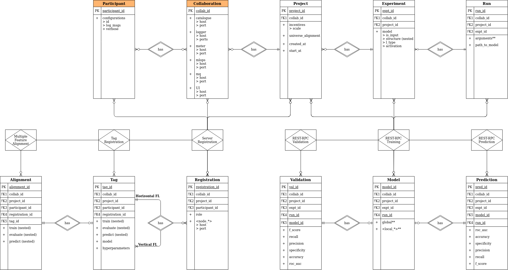

# Synergos Archive

Hierarchy enforcing component for all data entities in a Synergos network  

*Component repositories of Synergos [V3]*

The Synergos grid prides itself on its modular system of deployment, comprizing various deployment combinations as seen from the diagram above. General configurations are as follows:
1. **`Synergos Basic`** 
    > Simplest deployment pattern, consisting a duet of 2 containers - *Synergos-TTP* & *Synergos-Worker*. 
2. **`Synergos Plus`**
    > Intermediate deployment pattern that equips the grid with the capability to for metadata extraction/analysis. This allows users to gain access to hardware statistics, data-cataloguing, lineage tracking and general centrialised logging.
3. **`Synergos Cluster`**
    > Full distributed deployment pattern with job queue integration in addition to metadata extraction. This configuration is optimized for running concurrent federated cycles to facilitate hyperparameter tuning.

By having users install different components depending on their supposed role within the federated grid, most of the complexity associated with federated orchestrations are obscured completely from the users. Specifically, the goal is to stitch entire containers together with unique Dockerfile configurations.

This repository governs **Synergos Archive**, the core hierarchy enforcing component of Synergos, regardless of configuration.

---

## Installation
As Synergos is still under development, its components have yet to be deployed on PyPi. Hence, the best way to use Synergos Archive is to install it in development mode in a local virtualenv.

```
# Download source repository
git clone https://github.com/aimakerspace/synergos_archive.git
cd ./synergos_archive

# Setup virtual environment
conda create -n synergos_env python=3.7

# Install in development mode
pip install -e .
```

---

## How to use?
In Synergos, all payloads are arranged in hierarchies, allowing levelled access of any record type across the entire grid. This enhances data management procedures, since users of Synergos Archive have the ability to mask data by using the correct record level. This simplifies the integration with Synergos REST for inter-component compatibility.

```
from synarchive.connection import CollaborationRecords

##################
# Configurations #
##################

db_path = "/path/to/database.json"

####################
# Archive Creation #
####################

# Instantiate the corresponding archival object
collab_records = CollaborationRecords(db_path=db_path)

# Define & create a new entry
collab_id = "test_collaboration"
collab_info = {
    "logs": {
        "host": "172.20.0.14",
        "ports": {
            "director": 9200,
            "main": 9000,
            "sysmetrics": 9100,
            "ttp": 9300,
            "ui": 9000,
            "worker": 9400
        },
        "secure": false
    },
    "mlops": {
        "host": "172.20.0.15",
        "ports": {
            "main": 5500,
            "ui": 5500
        },
        "secure": false
    },
    "mq": {
        "host": "172.20.0.16",
        "ports": {
            "main": 5672,
            "ui": 15672
        },
        "secure": false
    }
}
collab_records.create(
    collab_id=collab_id,
    details=collab_details
)

# Retrieve an existing record
retrieved_records = collab_records.read(collab_id=collab_id)

# Update previously declared record
updated_collab_info = {
    "mq": {
        "host": "172.20.0.17",
        "ports": {
            "main": 6783,
            "ui": 16783
        },
        "secure": True
    }
}
collab_records.update(
    collab_id=collab_id, 
    updates=updated_collab_info
)

# Remove an existing record
collab_records.delete(collab_id=collab_id)
```
Retrieved records have a key named `relations`, where all relationships downstream of the archive are collected for subsequent use.

```
{
    'created_at': datetime.datetime(2021, 3, 18, 16, 33, 40),
    'key': {'collab_id': 'COLLAB_1-5363911b-4ee4-4138-b875-bfada9f8cd51'},
    "logs": {
        "host": "172.20.0.14",
        "ports": {
            "director": 9200,
            "main": 9000,
            "sysmetrics": 9100,
            "ttp": 9300,
            "ui": 9000,
            "worker": 9400
        },
        "secure": false
    },
    "mlops": {
        "host": "172.20.0.15",
        "ports": {
            "main": 5500,
            "ui": 5500
        },
        "secure": false
    },
    "mq": {
        "host": "172.20.0.16",
        "ports": {
            "main": 5672,
            "ui": 15672
        },
        "secure": false
    }
    'relations': {
        'Project': [
            {
                'created_at': datetime.datetime(2021, 3, 18, 16, 33, 40),
                'incentives': {},
                'key': {'collab_id': 'COLLAB_1-5363911b-4ee4-4138-b875-bfada9f8cd51',
                'project_id': 'PROJECT_0-7f5d5168-e472-4df2-b535-67e6c9b9c780'},
                'start_at': datetime.datetime(2021, 4, 10, 22, 33, 40),
                'universe_alignment': []
            },
            ...
        ],
        ...
    }
```

After deleting an archival record, everything within its corresponding downstream hierarchy gets destroyed.

---

## Further Documentations
For now, documentations are still in progress. In the meantime, use python's `help()` function to find out existing parameters to each of the task classes. 



*Interfacing components that make up the Synergos Archive package*

Alternatively, you may refer to the UML class diagram above for the list of functions supported for each component class.